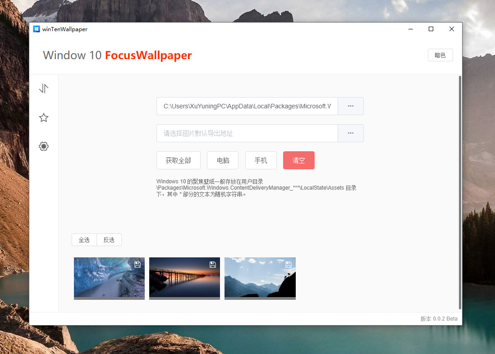

# Windows 10 Focus Wallpaper


> Windows 10 聚焦壁纸提取工具。



## 开发命令
```bash
# 开发调试
$ yarn run dev

# 构建 .exe 安装包
$ yarn run build
```

## 技术栈

- [electron-vue](https://github.com/SimulatedGREG/electron-vue)
- [vue.js](https://cn.vuejs.org/)
- [node.js](https://nodejs.org/)

## 下载超市

##### app-builder
- 大小：1.05M
- 存放路径：C:\Users\***\AppData\Local\electron-builder\cache\app-builder\app-builder-v0.6.1-x64
- 下载地址：https://github.com/develar/app-builder/releases/download/v0.6.1/app-builder-v0.6.1-win-x64.7z

##### winCodeSign
- 大小：3.83M
- 存放路径：C:\Users\***\AppData\Local\electron-builder\cache\winCodeSign\winCodeSign-1.9.0
- 下载地址：https://github.com/electron-userland/electron-builder-binaries/releases/download/winCodeSign-1.9.0/winCodeSign-1.9.0.7z

##### nsis
- 大小：1.32M
- 存放路径：C:\Users\***\AppData\Local\electron-builder\cache\nsis\nsis-3.0.1.13
- 下载地址：https://github.com/electron-userland/electron-builder-binaries/releases/download/nsis-3.0.1.13/nsis-3.0.1.13.7z

##### nsis-resources
- 大小：985K
- 存放路径：C:\Users\***\AppData\Local\electron-builder\cache\nsis-resources\nsis-resources-3.3.0
- 下载地址：https://github.com/electron-userland/electron-builder-binaries/releases/download/nsis-resources-3.3.0/nsis-resources-3.3.0.7z

## 关于

本项目仅为作者个人爱好和学习使用！
